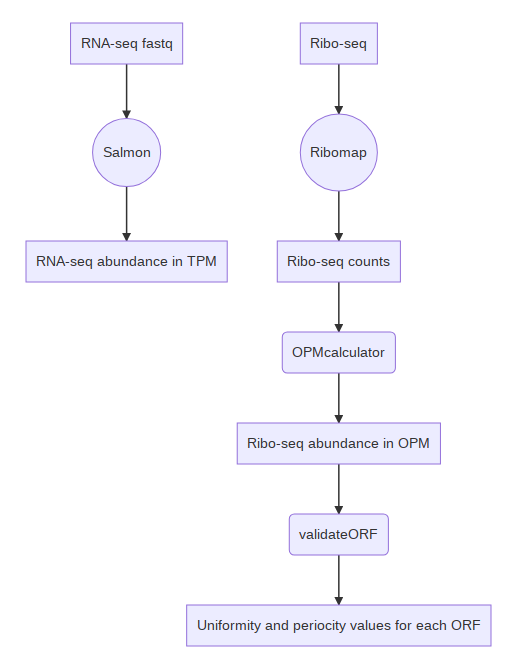
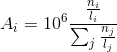

# ORQAS
This is a set of tools for **OR**F **Q**uantification pipeline for **A**lternative **S**plicing

- [Overview](#overview)
- [Requirements](#requirements)
-  [ORQAS pipeline](#orqas-pipeline)
	* [ORQAStoolkit](#3-orqastoolkit)
	   + [OPMcalculator](#3.1-OPMcalculator)
	    + [TXTtoCDS](#3.2-txttocds)
	    + [aggregateCDS](#3.3-aggregatecds)
	    + [validateORF](#3.4-validateorf)


This software was described and applied to multiple datasets in [(Reixachs-Sole et al. 2019)](https://www.biorxiv.org/content/10.1101/582031v2). No non-standard hardware is required to run these analyses. All analyses 
were run on workstations running Unix. The software is distributed under the MIT license.

## Overview

**ORQAS** includes a modified pipeline for isoform quantification based on [Ribomap](https://github.com/Kingsford-Group/ribomap) pipeline ([Wang et al. 2016](https://academic.oup.com/bioinformatics/article/32/12/1880/1744291)) and **ORQAStoolkit**, a set of additional tools for abundance calculation and other utilities.

 


## Requirements and dependencies

* Salmon(v0.7.2) - Pre-compiled executable included
* STAR (v2.4.0j) - Pre-compiled executable included
* Ribomap - Pre-requisites for Ribomap compilation: [boost](https://www.boost.org), [seqan (v1.4.1)](http://www.seqan.de)
* Python 3.5 - All Python modules used are included in th Python Standard Library. 


No non-standard software is required for running **ORQAS** pipeline.

This software has been developed and tested entirely in a Unix distribution. 


## Installation

**ORQAS** pipeline itself does not need further installation than the required software specified previously. 

STAR (v2.4.0j) and Salmon(v0.7.2) pre-compiled executables are included in the downloaded pipeline. 
Ribomap compliation details can be found [here](https://github.com/Kingsford-Group/ribomap#compile-from-source-code).

## ORQAS pipeline

To run ORQAS pipeline more easily you can execute a script called *run_ORQAS.sh*.  Yet, all the commands can be executed separately for a customized use of the pipeline. 
```
sh run_ORQAS.sh --rnaseq_fq rnaseq_fq --riboseq_fq riboseq_fq --cds_annotation cds.fa --txt_cds cds_annotation.ENSTtoCDS.txt --salmon_idx index_dir --salmon_strand U --psites psites.txt --wd orqas_output_directory
```

 - **--rnaseq_fq**: fastq files for the RNA-seq
 - **--riboseq_fq**: fastq files for the Ribo-seq
 - **--orqas_dir**: directory where orqas is placed, default is the current directory
- **--cds_annotation**: fasta file containing only CDS sequences. 
- **--txt_cds**: file containing transcript to CDS correspondence from the same fasta file (see [TXTtoCDS](#txttocds) section). 

- **--salmon_idx**: directory where the salmon index is placed. 
-  **--salmon_strand**: library type  of the RNA-seq encoded as Salmon libType  (see https://salmon.readthedocs.io/en/latest/library_type.html). 
- **--psites**: file with the corresponding psites (offsets) for each sample in the following format: 
```
read_length1 psite1
read_length2 psite2
etc.
```
- **--wd**: directory where the output will be written. 


### 1 Salmon
Salmon needs an index than can be created previous to running *run_ORQAS.sh* consistently with the characteristics of RNA-seq reads. If this index is not provided the ORQAS pipeline is going to create it with the following command: 
```
salmon index -t cds_annotation.fa -i salmon_idx --type quasi -k 31
```

Then the the following command can be executed to obtain the RNA-seq quantification in Transcripts Per Million (TPM): 

```
salmon quant -r rnaseq_fq -i salmon_idx --libType salmon_strand -o salmon_output
```

### 2 Ribomap 
```
ribomap/scripts/run_ribomap.sh --rnaseq_fq rnaseq_fq --riboseq_fq riboseq_fq --transcript_fa cds_annotation --work_dir orqas_output_directory --offset psites.txt --softClip
ping false --rnaUnstranded rnaseq_strand --sailfish_dir salmon_output
```

For a better understanding of ribomap and it's arguments please check [Ribomap GitHub page](https://github.com/Kingsford-Group/ribomap) . 

### 3 ORQAStoolkit

### 3.1 OPMcalculator

```
python ORQAStoolkit.py OPMcalculator -i orqas_output_directory -o output-prefix
```

This script takes ribosome counts from one or multiple Ribomap *.stats* output file and provides abundance values in a tab formatted file with as columns as input files, merged according to a common identifier.
If an identifier do not appear in a file, the corresponding field will be set to 0.

The abundance values are calculated similarly to the TPM (Transcripts Per Million) values in RNA-seq, but in this case they will be called **OPM (ORFs Per Million)**.



Where ni are the Ribo-seq counts and li the CDS effective length

>The effective length is taken from the Salmon file for RNA-seq by default since this pipeline is used for a quantification of RNA-seq over a CDS annotation. If it is performed with full transcripts you should specify the directory where the effective length of the CDS can be found. 


### 3.2 TXTtoCDS

Sometimes two different annotated CDS can encode the same sequence. This tool takes a fasta file of the annotation as an input and returns a file with the genes and its CDS merged according to the sequence. It supports any kind of header containing Ensemble transcript and gene IDs for each record. 

```
python ORQAStoolkit TXTtoCDS -i annotation-file.fa -o output-prefix
```

Output sample: 

```
Gene1	CDS1
Gene1	CDS2:CDS3
Gene2	CDS1:CDS2:CDS3
Gene2	CDS4
```
CDS with the same sequences are annotated with the two original ids delimited by a colon `:`.


### 3.3 aggregateCDS

As the counts and TPM values are calculated for each CDS with this script you can get the aggregated values in the cases were different CDS encode the same sequence. 

```
python ORQAStoolkit aggregateCDS -i input-file -s separator -f fields -o output-file -c txt-to-cds-file 
```

### 3.4 validateORF

**This step is not included in *run_ORQAS.sh* and has to be executed apart at the end of the pipeline**

Actively translated ORFs can be identified by calculating two parameters: read **periodicity** and read **uniformity** (Ji et al. 2015). 

- Periodicity is based on the distribution of the reads in the annotated frame and the two alternative ones. In order to calculate the read periodicity, we previously computed the position of the P-site, corresponding to the tRNA binding-site in the ribosome complex. 

- Uniformity is measured as the proportion of maximum entropy (PME) defined by the distribution of reads along the ORF.

ValidateORF can be run once we have executed *run_ORQAS.sh*. Due to the poor coverage of Ribo-seq reads it is useful to pool all samples from the same condition in order to estimate periodicity and uniformity values. 

```
python ORQAStoolkit validateORF -i input-files -o output-file -c txt-to-cds-file 
```

- **-i** : one or more files (space separated) with the *.base* files from ribomap output found in *orqas_output_directory/output* of each sample
- **-o**: output file with periodicity and uniformity values
- **-c**: transcript to CDS equivalence as provided by  [TXTtoCDS](#txttocds).


<!--stackedit_data:
eyJoaXN0b3J5IjpbMTg3MTU3MTU0OCwxNDUxODU1MjIsMjcyNj
Y2MDMxLC0xMzEzMTQzMDY5LDEzMTA1MjU0NCwtMzk0OTMwMTkw
LDEzMjExOTk2NjQsMjAxMTcwNDA0NCwtMTc4NDI3NDQyMiwtMT
g0NjIxMzY0MiwtMjA4OTc4Mjk3NCwyMDgxMzM4MTYyLC02OTUw
NDI4NDgsLTE0NDY2ODQ2OTQsOTA2NTU2NTY4LDM1MjY4NTQ1Ny
wxMTI1NzgxOTEwLDE3MjYwMjk1NjYsLTI2NzU3Njg5LC00MzA0
MDY3MzddfQ==
-->
